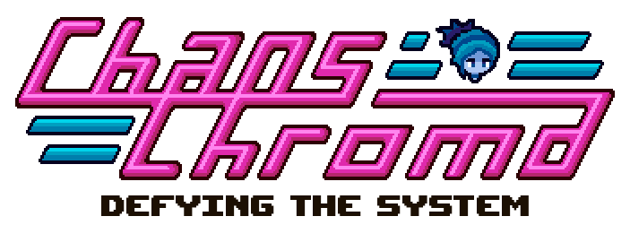

# Chaos Chroma

Chaos Chroma is a 2D action game set in a dystopian, cyberpunk world. Lachi is a rebel whose main mission is defeating the corruptive corporation which rules the society. In this vertical slice of the complete project, you will be able to dive right into the combat system and the platforming elements which compose the game.
The stunning pixel-art visuals as well as the beautiful art direction make for the visual experience of the game, a memorable one.
Please enjoy and leave feedback on the comments!

This is a game being developed by students from <a href="https://www.imagecampus.edu.ar/">Image Campus</a>

   

## Credits

- **Mateo “Topo” Fabbri** - *Programming*
- **Ian Kuznicki** - *Programming*
- **Francisco “Paco” Barbosa** - *Art*
- **Nazareno Rojas** - *Art*
- **Martin Galimany** - *Audio*
- **Ruby Valls** - *Audio*
- **Alan Ezequiel Aguirre** - *Audio*
- **Manuel Sánchez** - *Audio*
- **Nazareno Nespeca** - *Audio*
- **Leonardo Martin Nucaro** - *Testing*
- **Agustín Pratto** - *Testing*
- **Jesus Augusto Parra Capdevielle** - *Testing*

This game was also possible thanks to the support of these professors:

- **Sergio Baretto**
- **Juan Pablo Varela Aloisio**
- **Ramiro Cabrera**
- **Eugenio Taboada**
- **Nazareno Rivero**
- **Lucía Inés Patetta**

## Acknowledgements

- **Federico Barra**
- **Franco Guerra**
- **Silvina Lemos Hoffmann**

## Font Used

- **Upheaval** - *https://www.dafont.com/upheaval.font*

## Links

https://pack-o-punch.itch.io/chaos-chroma
